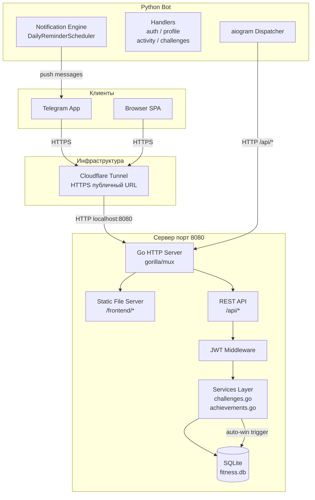
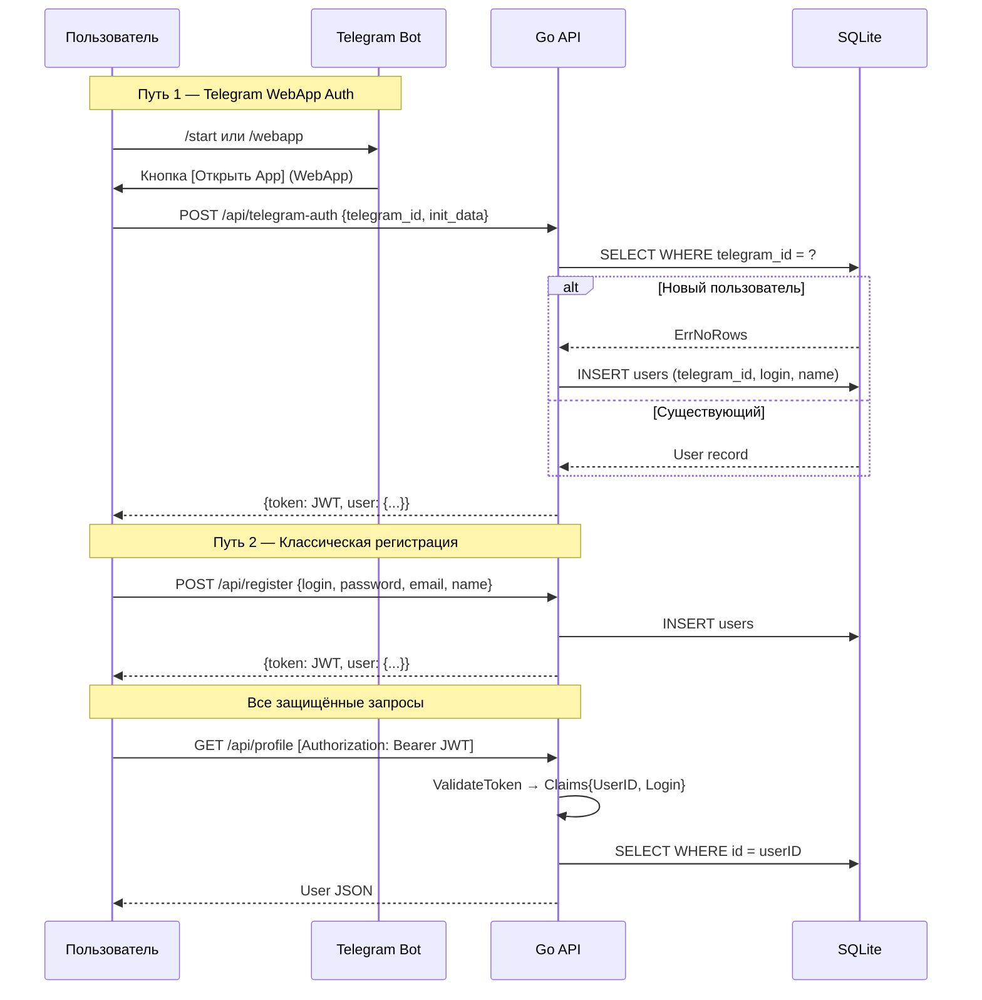
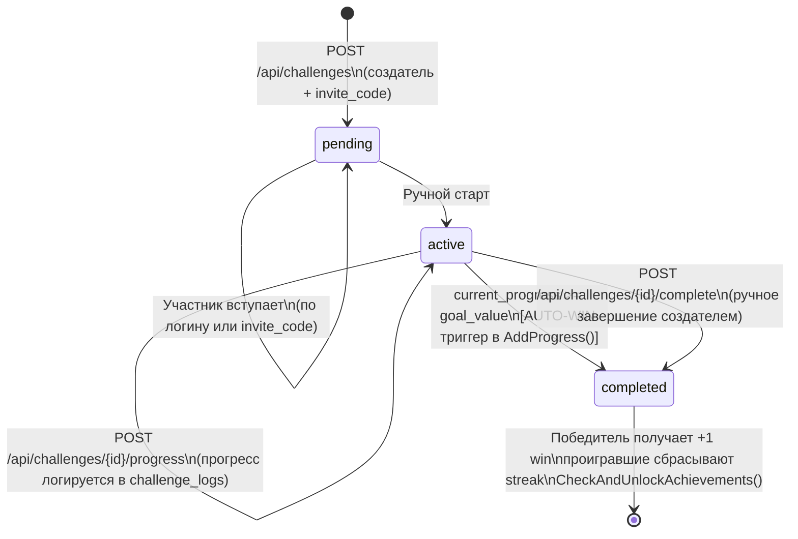

# FitnessApp — Платформа фитнес-челленджей

Социальная платформа для проведения фитнес-соревнований между пользователями. Пользователь создаёт челлендж, приглашает соперников по инвайт-коду или логину, фиксирует прогресс — система автоматически определяет победителя при достижении цели. Два интерфейса: Telegram Bot как основная точка входа и Web App (открывается прямо внутри Telegram).

**Ключевая инженерная задача:** обеспечить единый источник состояния (Go HTTP API + SQLite) для двух разных клиентов — браузерного SPA и Telegram Bot — с полной изоляцией сессий через JWT и автоматическим пробросом публичного HTTPS-URL через Cloudflare Tunnel (необходим для Telegram WebApp API).

---

## Технический стек

| Категория | Технологии |
|-----------|-----------|
| **Core** | Go 1.21+, gorilla/mux, Python 3.10+ |
| **Data** | SQLite (file-based, `fitness.db`) |
| **Auth** | JWT HS256, 30-дневные токены (`golang-jwt/jwt`) |
| **Bot** | aiogram 3.x (async), aiohttp, FSM (MemoryStorage) |
| **Infra** | Cloudflare Tunnel (`cloudflared`), Makefile-оркестрация |
| **Frontend** | Vanilla JS, HTML5 (Telegram WebApp SDK) |

---

## Архитектура системы

### Диаграмма потоков данных



### Поток аутентификации



### Жизненный цикл челленджа



---

## ADR — Архитектурные решения

### ADR-1: Go вместо Node.js/Python для API
Go выбран за нативную конкурентность через горутины и отсутствие рантаймного оверхеда — критично для одновременной обработки HTTP-запросов и Telegram-вебхуков без дополнительных воркеров. Стандартная библиотека `database/sql` даёт прямой контроль над транзакциями, что важно для атомарных операций завершения челленджа (обновление победителя + сброс стриков проигравших — в одной транзакции).

### ADR-2: SQLite вместо PostgreSQL
Для MVP-стадии SQLite обеспечивает нулевую инфраструктуру: один процесс, один файл, встроенные ACID-гарантии. Все операции с состоянием соревнований используют явные транзакции (`tx.Begin() / tx.Commit()`), что устраняет race conditions при параллельных запросах на вступление в челлендж. Миграция на PostgreSQL при масштабировании потребует только замены драйвера и DSN.

### ADR-3: Cloudflare Tunnel вместо собственного сервера
Telegram WebApp API требует публичного HTTPS-URL с валидным сертификатом. Cloudflare Tunnel (`cloudflared`) даёт это без настройки DNS, покупки домена или управления сертификатами. `make run-tunnel` автоматически парсит выданный URL из лога и патчит `.env` файл — бот подхватывает новый адрес при следующем запуске.

### ADR-4: Два канала уведомлений в Python-боте
Push-уведомления соперникам реализованы в боте (Python/aiogram), а не в Go-сервере — потому что Go-сервис не имеет прямого доступа к Telegram Bot API и не хранит сессии. Бот выступает как gateway: при логировании прогресса через `/progress` обращается к API за списком участников и рассылает им сообщения напрямую через Telegram.

---

## Схема базы данных

```
users
  id, email, login, password_hash, telegram_id
  name, age, height, weight, photo_url, description
  total_wins, current_streak, best_streak

activities
  id, user_id → users.id
  activity_type, duration, distance, calories, notes, activity_date

challenges
  id, creator_id → users.id
  title, description, type (accumulative|consistency)
  goal_value, max_participants (NULL = unlimited)
  start_date, end_date, status (pending|active|completed)
  winner_id → users.id, invite_code (UNIQUE)

challenge_participants
  challenge_id → challenges.id, user_id → users.id
  total_points, current_progress   ← основной счётчик прогресса

challenge_logs
  challenge_id, user_id, value, photo_file_id, notes, logged_at

achievements (предзаполнены при миграции)
  name, requirement_type (wins|streak), requirement_value, icon

user_achievements
  user_id, achievement_id, unlocked_at
```

---

## Запуск и развёртывание

### Требования

- Go 1.21+
- Python 3.10+
- `cloudflared` — `brew install cloudflared` (macOS)
- Telegram Bot Token от [@BotFather](https://t.me/BotFather)

### 1. Клонирование и настройка окружения

```bash
git clone <repo-url>
cd fitness-app

cp .env.example .env
```

Откройте `.env` и заполните обязательные переменные:

```env
# Telegram Bot
TELEGRAM_BOT_TOKEN=your_bot_token_here

# JWT (смените в продакшне!)
JWT_SECRET=your-secret-key-change-in-production

# Настройки сервера
PORT=8080
DB_PATH=fitness.db

# URL Web App (заполняется автоматически через make run-tunnel)
API_URL=http://localhost:8080/api
WEBAPP_URL=https://<your-tunnel>.trycloudflare.com/webapp.html
```

### 2. Установка зависимостей

```bash
make install
```

Команда выполняет `go mod download` для бэкенда и `pip3 install -r requirements.txt` для бота.

### 3. Запуск (три терминала)

**Терминал 1 — Go API сервер:**
```bash
make run-backend
# Сервер стартует на :8080
# SQLite база создаётся автоматически, миграции применяются при инициализации
```

**Терминал 2 — Cloudflare Tunnel:**
```bash
make run-tunnel
# Выводит публичный HTTPS URL
# Автоматически обновляет WEBAPP_URL в .env
```

**Терминал 3 — Telegram Bot:**
```bash
make run-bot
# Читает WEBAPP_URL из .env (перезапустить после смены тоннеля!)
```

**Или всё сразу в фоне:**
```bash
make dev
```

### 4. Проверка состояния

```bash
make status
```

```bash
# Тест регистрации
make test-register

# Тест API вручную
curl -X POST http://localhost:8080/api/register \
  -H "Content-Type: application/json" \
  -d '{"login":"alice","password":"pass123","email":"alice@example.com","name":"Alice"}'
```

### 5. Управление

```bash
make stop       # мягкая остановка всех процессов
make kill-all   # принудительное завершение (SIGKILL)
make init-db    # сброс базы данных
make clean      # удалить бинарники, БД, логи, кэши
```

---

## API Reference

| Метод | Путь | Auth | Описание |
|-------|------|------|----------|
| POST | `/api/register` | — | Регистрация пользователя |
| POST | `/api/login` | — | Вход по логину/паролю |
| POST | `/api/telegram-auth` | — | Вход через Telegram WebApp |
| GET | `/api/profile` | JWT | Профиль текущего пользователя |
| PUT | `/api/profile` | JWT | Обновление профиля |
| POST | `/api/activities` | JWT | Логирование активности |
| GET | `/api/activities?period=week` | JWT | Список активностей (week/month/year/all) |
| POST | `/api/challenges` | JWT | Создать челлендж |
| GET | `/api/challenges` | JWT | Мои челленджи |
| GET | `/api/challenges/{id}` | JWT | Детали челленджа |
| POST | `/api/challenges/{id}/join` | JWT | Вступить в челлендж |
| POST | `/api/challenges/join/{code}` | JWT | Вступить по инвайт-коду |
| POST | `/api/challenges/{id}/progress` | JWT | Добавить прогресс |
| GET | `/api/challenges/{id}/progress` | JWT | Прогресс участников |
| GET | `/api/challenges/{id}/logs` | JWT | Лог прогресса |
| POST | `/api/challenges/{id}/complete` | JWT | Завершить вручную (только создатель) |
| GET | `/api/achievements` | JWT | Мои достижения |
| GET | `/api/leaderboard?type=wins` | JWT | Таблица лидеров (wins/streak) |

---

## Достижения (предзаполнены)

| Иконка | Название | Условие |
|--------|----------|---------|
| 🥉 | First Blood | 5 побед |
| 🥈 | Rising Star | 10 побед |
| 🥇 | Champion | 15 побед |
| 🏆 | Legend | 20 побед |
| 👑 | Master | 30 побед |
| 💎 | Grandmaster | 50 побед |
| 🌟 | Ultimate | 100 побед |
| 🔥 | On Fire | стрик 3 |
| ⚡ | Unstoppable | стрик 5 |
| 💫 | Godlike | стрик 10 |

---

## Deliverables

*Soon...*
